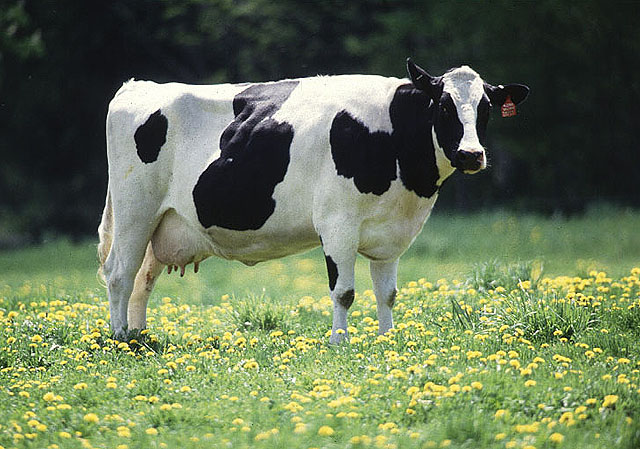

## research

Research in our lab combines 1) field and laboratory experiments using livestock animals such as dairy cattle, and tractable model organisms such as fruit flies; 2) state-of-the-art high throughput genomic technologies such as next generation sequencing that are capable of generating massive amount of data; and 3) advanced theoretical, statistical and computational methods to make inferences from large-scale experimental and genomic data. The long-term goals of our research are to understand how quantitative trait variation, particularly the part that is heritable and actionable, is generated, maintained, and dynamically changed. Answering these questions not only is important for understanding evolution and biological processes, but also holds practical promises in agriculture and medicine.
      

 

Individual variation is ubiquitous in nature - "*no two leaves are the same*". It is one of the most important properties of evolving populations; natural selection acts on it, evolution depends on it. The phrase "*survival of the fittest*" implies that there are individuals that are fitter and there are also individuals that are less fit, which is variation in fitness. We have known for more than a century that such variation is due to both genetic and environmental influences and the interplay between them. Our lab is interested in finding the parts that make up the variation, and the processes by which the variation is generated.
